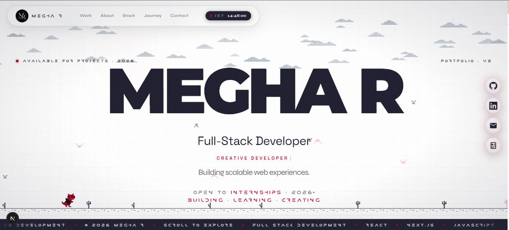

# MEGHA R — PORTFOLIO V2

> An interactive personal portfolio built to showcase my work, skills, projects, and development journey as a Full-Stack Developer.

---

## 🚀 Overview

**MEGHA R — PORTFOLIO V2** is my personal portfolio website, designed and developed to showcase my skills, projects, education, experience, and development journey as a Full-Stack Developer.

Built with **Next.js, React, and Tailwind CSS**, the portfolio combines modern web development with smooth animations, interactive micro-interactions, pixel-art elements, responsive design, and a distinctive visual identity to create an engaging and memorable browsing experience.

---

## 👋 About Me

Hi, I'm **Megha R**, a **B.Tech Computer Science Engineering student** specializing in **Software Product Engineering**. I'm passionate about building modern, responsive, and scalable web applications and turning ideas into meaningful digital experiences.

I enjoy working across the **MERN stack** and exploring modern web technologies, with a strong interest in **full-stack development, software engineering, interactive UI, and building practical solutions to real-world problems**.

I'm continuously learning, building projects, and improving my technical skills as I work toward becoming a strong software engineer.

---

## 🎯 Purpose

The portfolio serves as my digital identity and professional showcase. It highlights:
- My development skills and technologies
- Selected personal projects
- Education and career journey
- Professional credentials
- GitHub and LinkedIn profiles
- Resume and contact information

The goal is to provide a **clean, premium, and engaging user experience** while demonstrating my frontend and full-stack development capabilities.

---

## ✨ Key Features

### 🎬 Dynamic Intro Preloader
- Custom 8-bit inspired loading animation
- 2-second loading sequence
- Animated intro text reveal
- Smooth transition into the homepage

### 🦖 Interactive Pixel Dino Runner
- Custom pixel-art dinosaur animation
- Integrated into the **SEE MORE / SHOW LESS** project control
- Dinosaur runs continuously like a mini endless runner
- Obstacles move toward the dinosaur
- Automatic jumping synchronized with incoming obstacles

### 🖥️ Interactive Hero Section
- Large animated typography
- Interactive navigation
- Dynamic role/title presentation
- Animated CTA elements
- Crimson glow effects and micro-interactions

### 💼 Interactive Project Showcase
- Selected projects displayed through custom project cards
- Expandable project list using **SEE MORE / SHOW LESS**
- Project preview images
- Technology tags
- GitHub links
- Live project links
- Hover and motion interactions

### 🧭 Interactive Navigation
- Floating navigation bar
- Magnetic navigation interactions
- Social links for GitHub, LinkedIn, Email, and Resume
- Responsive navigation behavior

### 📊 Infinite Stats Marquee
- Continuously scrolling statistics and technology ticker
- Seamless looping animation
- Integrated into the overall visual system

### 🖱️ Custom Cursor & Smooth Scrolling
- Custom cursor interaction
- Cursor glow effect
- Smooth scrolling powered by **Lenis**
- Motion-based scroll interactions

### ✨ Scroll & Text Reveals
- Animated content reveals
- Word-by-word text animations
- Viewport-based motion effects
- Custom Framer Motion animation variants

---

## 🛠️ Tech Stack

| Technology | Purpose |
|------------|---------|
| **Next.js 16.2.6** | React framework and application structure |
| **React 19.2.4** | UI development |
| **TypeScript** | Type-safe development |
| **Tailwind CSS v4** | Styling and responsive layouts |
| **Framer Motion 12.39.0** | Animations and interactions |
| **Lenis 1.3.23** | Smooth scrolling |
| **Lucide React** | Icons |
| **clsx** | Conditional class utilities |
| **tailwind-merge** | Tailwind class merging |

### Fonts
- Inter
- Space Grotesk
- Instrument Serif
- Montserrat
- Syne
- Geist Sans
- Geist Mono
- Researcher — custom local font

---

## 🎨 Design System

The portfolio follows a minimal, futuristic visual language built around:
- **Pure White** — `#FFFFFF`
- **Dark Navy** — `#1E1E2F`
- **Crimson Red** — `#B40023`

The interface combines:
- Pixel-art elements
- Grid-based backgrounds
- Minimal typography
- Crimson accent lighting
- Motion-driven interactions
- Clean geometric layouts

---

## 📱 Responsive Design

The portfolio is designed to work across:
- 📱 Mobile
- 📱 Tablet
- 💻 Laptop
- 🖥️ Desktop

Complex interactive elements are optimized for smaller screens to maintain a smooth and efficient experience.

---

## 📂 Project Structure

```text
MeghaR_portfolio/
├── app/
│   ├── page.tsx
│   ├── layout.tsx
│   ├── globals.css
│   └── favicon/
├── components/
│   ├── effects/
│   │   ├── ScrollReveal
│   │   ├── CursorGlow
│   │   ├── IntroPreloader
│   │   └── SmoothScroll
│   ├── hero/
│   │   ├── AnimatedHeroHeading
│   │   ├── DinoRunner
│   │   └── TimePill
│   ├── navigation/
│   │   ├── AnimatedDock
│   │   └── MagneticNavItem
│   ├── sections/
│   │   ├── About
│   │   ├── Credentials
│   │   └── Expertise
│   ├── shared/
│   │   ├── StatsMarquee
│   │   ├── BottomTicker
│   │   └── HireMeModal
│   └── ui/
│       ├── PixelSeeMoreButton
│       ├── IntroLoadingBar
│       ├── TiltCard
│       └── MeshText
├── public/
│   ├── images/
│   ├── fonts/
│   ├── logos/
│   └── svg/
├── package.json
├── tsconfig.json
├── next.config.ts
└── README.md
```

---

## 💻 Getting Started

**1. Clone the repository**
```bash
git clone https://github.com/Megha-r20/MeghaR_portfolio.git
cd MeghaR_portfolio
```

**2. Install dependencies**
```bash
npm install
```

**3. Start the development server**
```bash
npm run dev
```
Open [http://localhost:3000](http://localhost:3000) in your browser.

---

## 🏗️ Production Build

Create an optimized production build:
```bash
npm run build
```

Start the production server:
```bash
npm run start
```

---

## 🔗 Links

- **Live Portfolio:** `[Add your live URL here once deployed]`
- **GitHub Repository:** [https://github.com/Megha-r20/MeghaR_portfolio](https://github.com/Megha-r20/MeghaR_portfolio)

---

## 📬 Contact

**Megha R**  
*Full-Stack Developer*  
- **Email:** [megha.ragumani@gmail.com](mailto:megha.ragumani@gmail.com)
- **LinkedIn:** [https://www.linkedin.com/in/megha-r20](https://www.linkedin.com/in/megha-r20)
- **GitHub:** [https://github.com/Megha-r20](https://github.com/Megha-r20)

---

## 📸 Portfolio Preview



---

## 📜 License

**Copyright © 2026 Megha R.**  
**All rights reserved.**
